# Diagramas UML - Sistema Barceloneta

**Sistema de Gestión de Tickets de Viaje**
**Versión:** 1.0-FASE2
**Autor:** Alfredo David Bautista Romero
**Universidad Popular del Cesar - POO II**

---

## Tabla de Contenidos

1. [Diagrama de Clases](#diagrama-de-clases)
2. [Diagrama de Casos de Uso](#diagrama-de-casos-de-uso)
3. [Diagrama de Secuencia](#diagrama-de-secuencia)
4. [Diagrama de Componentes](#diagrama-de-componentes)
5. [Diagrama de Actividad](#diagrama-de-actividad)

---

## Diagrama de Clases

### Capa de Modelo

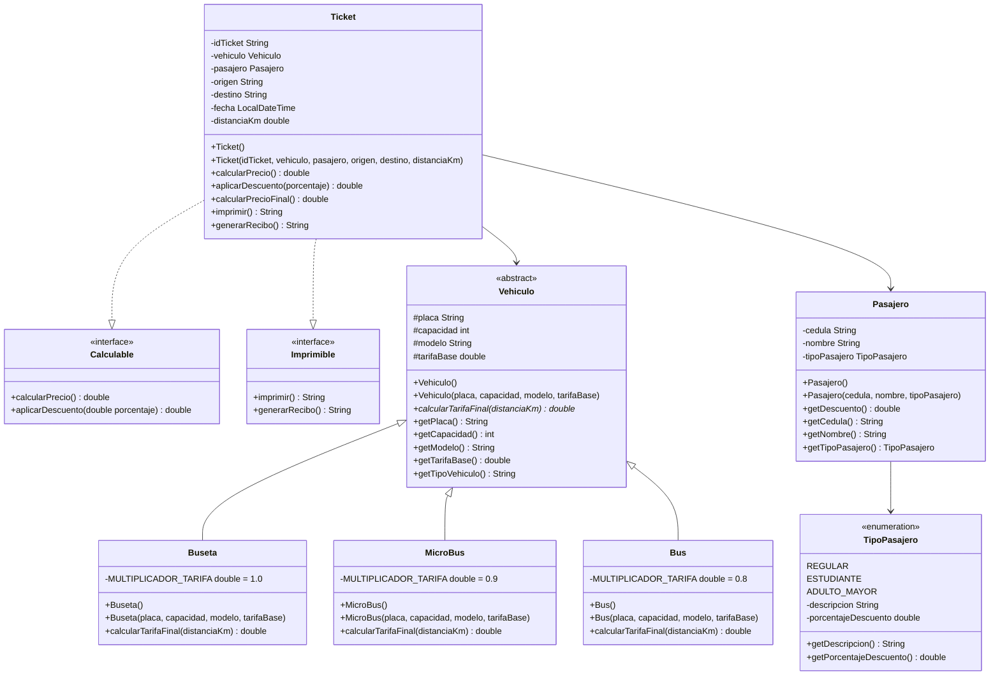

### Capa de Persistencia

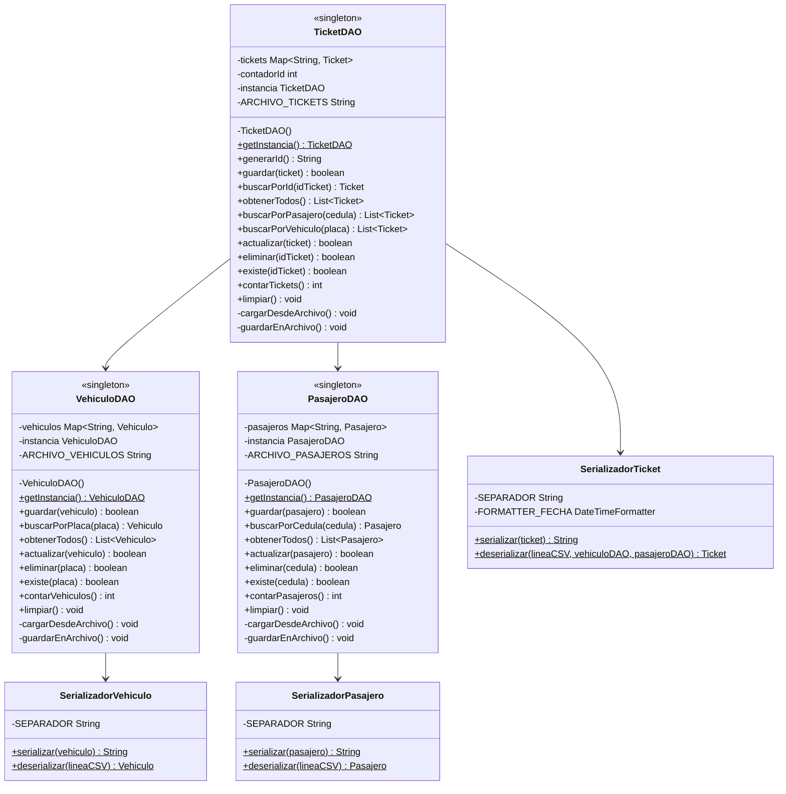

### Capa de Lógica y Presentación

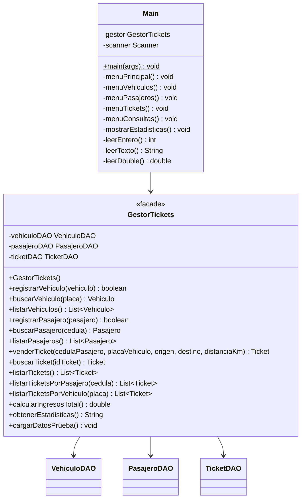

---

## Diagrama de Casos de Uso

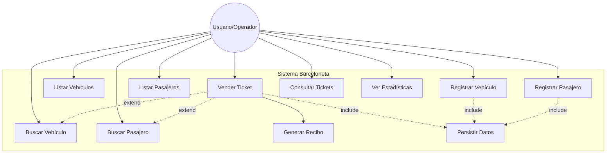

**Descripción de Casos de Uso:**

| ID | Caso de Uso | Descripción |
|----|-------------|-------------|
| UC1 | Registrar Vehículo | El usuario registra un nuevo vehículo en el sistema |
| UC2 | Buscar Vehículo | El usuario busca un vehículo por placa |
| UC3 | Listar Vehículos | El usuario visualiza todos los vehículos registrados |
| UC4 | Registrar Pasajero | El usuario registra un nuevo pasajero |
| UC5 | Buscar Pasajero | El usuario busca un pasajero por cédula |
| UC6 | Listar Pasajeros | El usuario visualiza todos los pasajeros |
| UC7 | Vender Ticket | El usuario vende un ticket de viaje |
| UC8 | Consultar Tickets | El usuario consulta tickets vendidos |
| UC9 | Ver Estadísticas | El usuario visualiza estadísticas del sistema |
| UC10 | Generar Recibo | El sistema genera un recibo de compra |
| UC11 | Persistir Datos | El sistema guarda datos en archivos CSV |

---

## Diagrama de Secuencia

### Secuencia: Vender Ticket

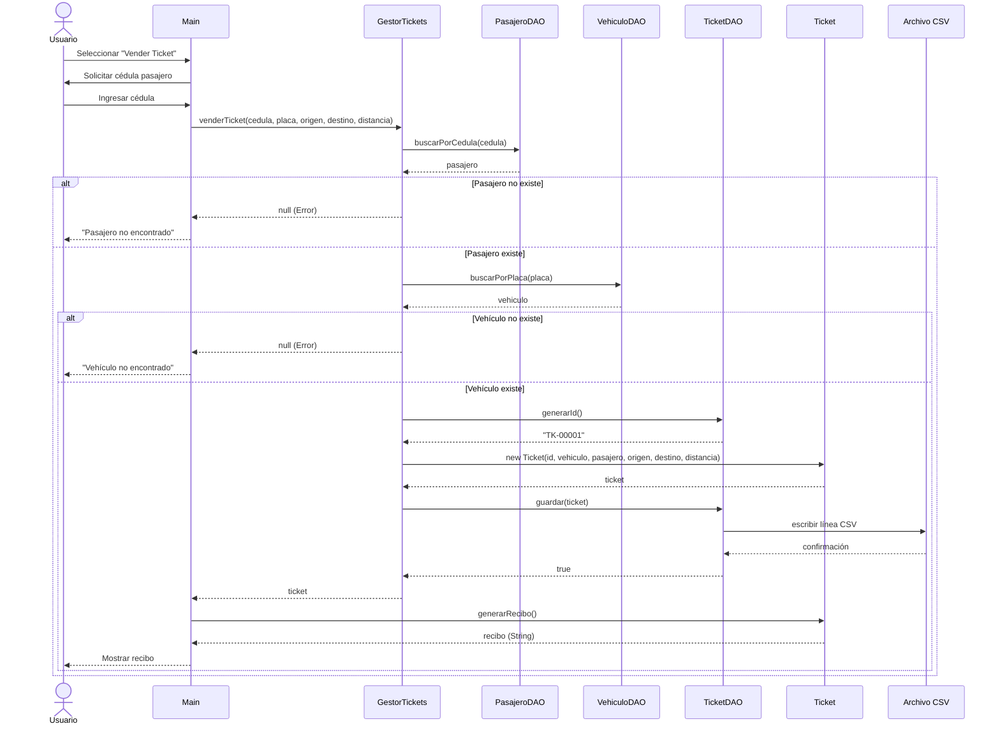

### Secuencia: Cargar Datos al Iniciar

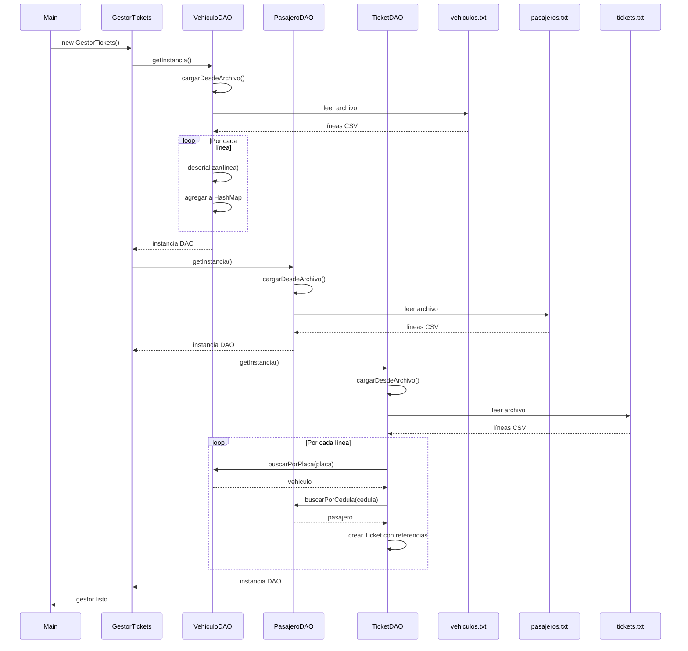

---

## Diagrama de Componentes

### Arquitectura en 3 Capas

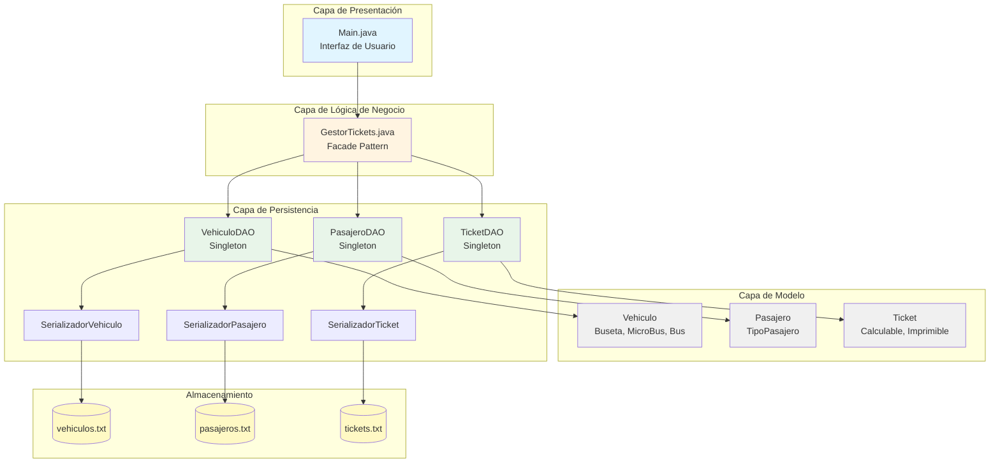

### Patrones de Diseño

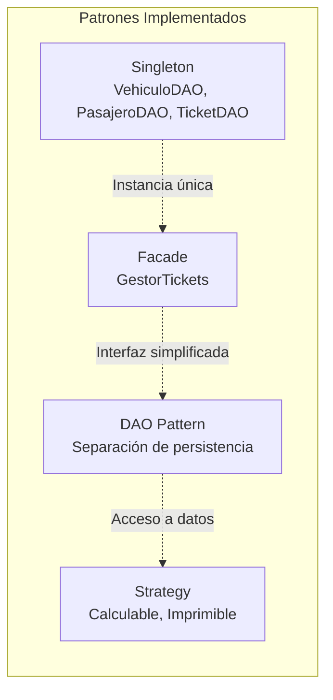

---

## Diagrama de Actividad

### Actividad: Proceso de Venta de Ticket

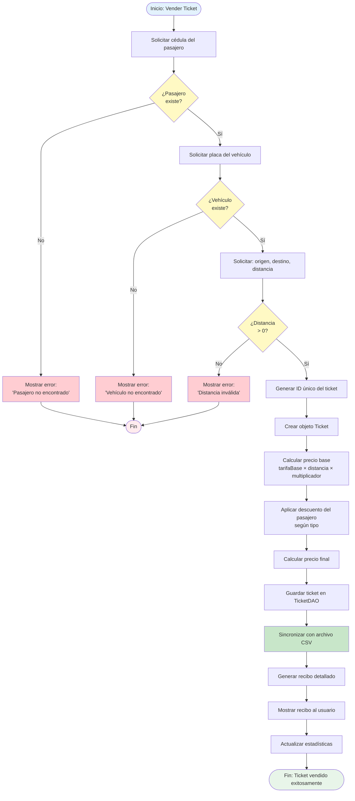

### Actividad: Persistencia Automática

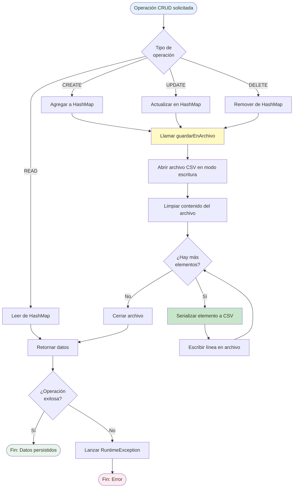

---

## Relaciones entre Diagramas

### Trazabilidad

| Componente | Diagrama de Clases | Diagrama de Secuencia | Diagrama de Componentes |
|------------|-------------------|----------------------|------------------------|
| GestorTickets | Clase Facade | Actor principal | Capa de Lógica |
| VehiculoDAO | Clase Singleton | Participante | Capa de Persistencia |
| PasajeroDAO | Clase Singleton | Participante | Capa de Persistencia |
| TicketDAO | Clase Singleton | Participante | Capa de Persistencia |
| Serializadores | Clases estáticas | - | Capa de Persistencia |
| Archivos CSV | - | Participante | Almacenamiento |

---

## Conceptos POO Demostrados

### 1. Herencia

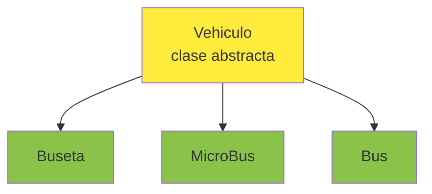

### 2. Polimorfismo

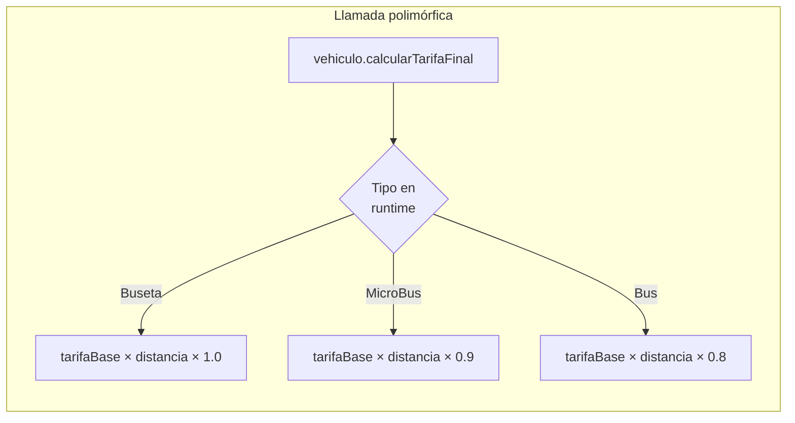

### 3. Interfaces

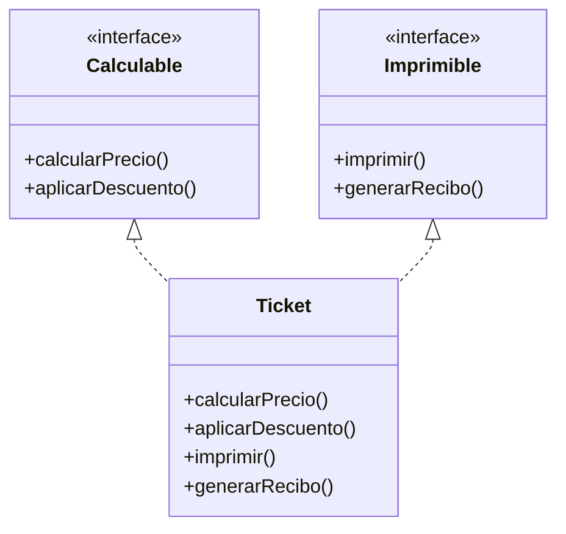

---

## Notas de Implementación

### Convenciones Usadas en los Diagramas

| Símbolo | Significado |
|---------|-------------|
| `+` | public |
| `-` | private |
| `#` | protected |
| `*` | método abstracto |
| `$` | método estático |
| `<<interface>>` | interfaz |
| `<<abstract>>` | clase abstracta |
| `<<singleton>>` | patrón singleton |
| `<<facade>>` | patrón facade |

### Colores en Diagramas

- 🔵 **Azul**: Capa de Presentación
- 🟡 **Amarillo**: Capa de Lógica
- ⚪ **Gris**: Capa de Modelo
- 🟢 **Verde**: Capa de Persistencia
- 🟨 **Amarillo claro**: Almacenamiento

---

## Referencias

- **Documentación oficial:** README.md
- **Manual de usuario:** MANUAL_USUARIO.md
- **Pruebas:** PRUEBAS_FASE2.md
- **Repositorio:** https://github.com/Alfredobau08/Barceloneta

---

**Última actualización:** Noviembre 2025
**Versión:** 1.0-FASE2
**Herramienta:** Mermaid Chart
