# Diagramas UML - Sistema Barceloneta

**Sistema de Gestión de Tickets de Viaje**
**Versión:** 1.0-FASE2
**Autor:** Alfredo David Bautista Romero
**Universidad Popular del Cesar - POO II**

---

## Tabla de Contenidos

1. [Diagrama de Clases](#diagrama-de-clases)
2. [Diagrama de Casos de Uso](#diagrama-de-casos-de-uso)
3. [Diagrama de Secuencia](#diagrama-de-secuencia)
4. [Diagrama de Componentes](#diagrama-de-componentes)
5. [Diagrama de Actividad](#diagrama-de-actividad)

---

## Diagrama de Clases

### Capa de Modelo

### Capa de Persistencia

### Capa de Lógica y Presentación

---

## Diagrama de Casos de Uso

**Descripción de Casos de Uso:**

| ID | Caso de Uso | Descripción |
|----|-------------|-------------|
| UC1 | Registrar Vehículo | El usuario registra un nuevo vehículo en el sistema |
| UC2 | Buscar Vehículo | El usuario busca un vehículo por placa |
| UC3 | Listar Vehículos | El usuario visualiza todos los vehículos registrados |
| UC4 | Registrar Pasajero | El usuario registra un nuevo pasajero |
| UC5 | Buscar Pasajero | El usuario busca un pasajero por cédula |
| UC6 | Listar Pasajeros | El usuario visualiza todos los pasajeros |
| UC7 | Vender Ticket | El usuario vende un ticket de viaje |
| UC8 | Consultar Tickets | El usuario consulta tickets vendidos |
| UC9 | Ver Estadísticas | El usuario visualiza estadísticas del sistema |
| UC10 | Generar Recibo | El sistema genera un recibo de compra |
| UC11 | Persistir Datos | El sistema guarda datos en archivos CSV |

---

## Diagrama de Secuencia

### Secuencia: Vender Ticket

```mermaid
sequenceDiagram
    actor Usuario
    participant Main
    participant GestorTickets
    participant PasajeroDAO
    participant VehiculoDAO
    participant TicketDAO
    participant Ticket
    participant CSV as Archivo CSV

    Usuario->>Main: Seleccionar "Vender Ticket"
    Main->>Usuario: Solicitar cédula pasajero
    Usuario->>Main: Ingresar cédula
    Main->>GestorTickets: venderTicket(cedula, placa, origen, destino, distancia)

    GestorTickets->>PasajeroDAO: buscarPorCedula(cedula)
    PasajeroDAO-->>GestorTickets: pasajero

    alt Pasajero no existe
        GestorTickets-->>Main: null (Error)
        Main-->>Usuario: "Pasajero no encontrado"
    else Pasajero existe
        GestorTickets->>VehiculoDAO: buscarPorPlaca(placa)
        VehiculoDAO-->>GestorTickets: vehiculo

        alt Vehículo no existe
            GestorTickets-->>Main: null (Error)
            Main-->>Usuario: "Vehículo no encontrado"
        else Vehículo existe
            GestorTickets->>TicketDAO: generarId()
            TicketDAO-->>GestorTickets: "TK-00001"

            GestorTickets->>Ticket: new Ticket(id, vehiculo, pasajero, origen, destino, distancia)
            Ticket-->>GestorTickets: ticket

            GestorTickets->>TicketDAO: guardar(ticket)
            TicketDAO->>CSV: escribir línea CSV
            CSV-->>TicketDAO: confirmación
            TicketDAO-->>GestorTickets: true

            GestorTickets-->>Main: ticket
            Main->>Ticket: generarRecibo()
            Ticket-->>Main: recibo (String)
            Main-->>Usuario: Mostrar recibo
        end
    end
```

### Secuencia: Cargar Datos al Iniciar

```mermaid
sequenceDiagram
    participant Main
    participant GestorTickets
    participant VehiculoDAO
    participant PasajeroDAO
    participant TicketDAO
    participant CSV_V as vehiculos.txt
    participant CSV_P as pasajeros.txt
    participant CSV_T as tickets.txt

    Main->>GestorTickets: new GestorTickets()
    GestorTickets->>VehiculoDAO: getInstancia()

    VehiculoDAO->>VehiculoDAO: cargarDesdeArchivo()
    VehiculoDAO->>CSV_V: leer archivo
    CSV_V-->>VehiculoDAO: líneas CSV

    loop Por cada línea
        VehiculoDAO->>VehiculoDAO: deserializar(linea)
        VehiculoDAO->>VehiculoDAO: agregar a HashMap
    end

    VehiculoDAO-->>GestorTickets: instancia DAO

    GestorTickets->>PasajeroDAO: getInstancia()
    PasajeroDAO->>PasajeroDAO: cargarDesdeArchivo()
    PasajeroDAO->>CSV_P: leer archivo
    CSV_P-->>PasajeroDAO: líneas CSV
    PasajeroDAO-->>GestorTickets: instancia DAO

    GestorTickets->>TicketDAO: getInstancia()
    TicketDAO->>TicketDAO: cargarDesdeArchivo()
    TicketDAO->>CSV_T: leer archivo
    CSV_T-->>TicketDAO: líneas CSV

    loop Por cada línea
        TicketDAO->>VehiculoDAO: buscarPorPlaca(placa)
        VehiculoDAO-->>TicketDAO: vehiculo
        TicketDAO->>PasajeroDAO: buscarPorCedula(cedula)
        PasajeroDAO-->>TicketDAO: pasajero
        TicketDAO->>TicketDAO: crear Ticket con referencias
    end

    TicketDAO-->>GestorTickets: instancia DAO
    GestorTickets-->>Main: gestor listo
```

---

## Diagrama de Componentes

### Arquitectura en 3 Capas

```mermaid
graph TB
    subgraph "Capa de Presentación"
        Main[Main.java<br/>Interfaz de Usuario]
    end

    subgraph "Capa de Lógica de Negocio"
        Gestor[GestorTickets.java<br/>Facade Pattern]
    end

    subgraph "Capa de Modelo"
        Vehiculo[Vehiculo<br/>Buseta, MicroBus, Bus]
        Pasajero[Pasajero<br/>TipoPasajero]
        Ticket[Ticket<br/>Calculable, Imprimible]
    end

    subgraph "Capa de Persistencia"
        VDAO[VehiculoDAO<br/>Singleton]
        PDAO[PasajeroDAO<br/>Singleton]
        TDAO[TicketDAO<br/>Singleton]
        SerV[SerializadorVehiculo]
        SerP[SerializadorPasajero]
        SerT[SerializadorTicket]
    end

    subgraph "Almacenamiento"
        CSV_V[(vehiculos.txt)]
        CSV_P[(pasajeros.txt)]
        CSV_T[(tickets.txt)]
    end

    Main --> Gestor
    Gestor --> VDAO
    Gestor --> PDAO
    Gestor --> TDAO

    VDAO --> Vehiculo
    PDAO --> Pasajero
    TDAO --> Ticket

    VDAO --> SerV
    PDAO --> SerP
    TDAO --> SerT

    SerV --> CSV_V
    SerP --> CSV_P
    SerT --> CSV_T

    style Main fill:#e1f5ff
    style Gestor fill:#fff4e1
    style Vehiculo fill:#f0f0f0
    style Pasajero fill:#f0f0f0
    style Ticket fill:#f0f0f0
    style VDAO fill:#e8f5e9
    style PDAO fill:#e8f5e9
    style TDAO fill:#e8f5e9
    style CSV_V fill:#fff9c4
    style CSV_P fill:#fff9c4
    style CSV_T fill:#fff9c4
```

### Patrones de Diseño

```mermaid
graph LR
    subgraph "Patrones Implementados"
        Singleton[Singleton<br/>VehiculoDAO, PasajeroDAO, TicketDAO]
        Facade[Facade<br/>GestorTickets]
        DAO[DAO Pattern<br/>Separación de persistencia]
        Strategy[Strategy<br/>Calculable, Imprimible]
    end

    Singleton -.-> |"Instancia única"| Facade
    Facade -.-> |"Interfaz simplificada"| DAO
    DAO -.-> |"Acceso a datos"| Strategy
```

---

## Diagrama de Actividad

### Actividad: Proceso de Venta de Ticket

### Actividad: Persistencia Automática

```mermaid
flowchart TD
    Start([Operación CRUD solicitada]) --> Type{Tipo de<br/>operación}

    Type -->|CREATE| Create[Agregar a HashMap]
    Type -->|UPDATE| Update[Actualizar en HashMap]
    Type -->|DELETE| Delete[Remover de HashMap]
    Type -->|READ| Read[Leer de HashMap]

    Create --> Write[Llamar guardarEnArchivo]
    Update --> Write
    Delete --> Write
    Read --> Return[Retornar datos]

    Write --> Open[Abrir archivo CSV en modo escritura]
    Open --> Clear[Limpiar contenido del archivo]
    Clear --> Loop{¿Hay más<br/>elementos?}

    Loop -->|Sí| Serialize[Serializar elemento a CSV]
    Serialize --> WriteLine[Escribir línea en archivo]
    WriteLine --> Loop

    Loop -->|No| Close[Cerrar archivo]
    Close --> Return

    Return --> Success{¿Operación<br/>exitosa?}
    Success -->|Sí| End1([Fin: Datos persistidos])
    Success -->|No| Error[Lanzar RuntimeException]
    Error --> End2([Fin: Error])

    style Start fill:#e3f2fd
    style End1 fill:#e8f5e9
    style End2 fill:#ffebee
    style Write fill:#fff9c4
    style Serialize fill:#c8e6c9
```

---

## Relaciones entre Diagramas

### Trazabilidad

| Componente | Diagrama de Clases | Diagrama de Secuencia | Diagrama de Componentes |
|------------|-------------------|----------------------|------------------------|
| GestorTickets | Clase Facade | Actor principal | Capa de Lógica |
| VehiculoDAO | Clase Singleton | Participante | Capa de Persistencia |
| PasajeroDAO | Clase Singleton | Participante | Capa de Persistencia |
| TicketDAO | Clase Singleton | Participante | Capa de Persistencia |
| Serializadores | Clases estáticas | - | Capa de Persistencia |
| Archivos CSV | - | Participante | Almacenamiento |

---

## Conceptos POO Demostrados

### 1. Herencia

### 2. Polimorfismo

```mermaid
flowchart LR
    subgraph "Llamada polimórfica"
        Call[vehiculo.calcularTarifaFinal] --> Runtime{Tipo en<br/>runtime}
        Runtime -->|Buseta| Impl1[tarifaBase × distancia × 1.0]
        Runtime -->|MicroBus| Impl2[tarifaBase × distancia × 0.9]
        Runtime -->|Bus| Impl3[tarifaBase × distancia × 0.8]
    end
```

### 3. Interfaces

---

## Notas de Implementación

### Convenciones Usadas en los Diagramas

| Símbolo | Significado |
|---------|-------------|
| `+` | public |
| `-` | private |
| `#` | protected |
| `*` | método abstracto |
| `$` | método estático |
| `<<interface>>` | interfaz |
| `<<abstract>>` | clase abstracta |
| `<<singleton>>` | patrón singleton |
| `<<facade>>` | patrón facade |

### Colores en Diagramas

- 🔵 **Azul**: Capa de Presentación
- 🟡 **Amarillo**: Capa de Lógica
- ⚪ **Gris**: Capa de Modelo
- 🟢 **Verde**: Capa de Persistencia
- 🟨 **Amarillo claro**: Almacenamiento

---

## Referencias

- **Documentación oficial:** README.md
- **Manual de usuario:** MANUAL_USUARIO.md
- **Pruebas:** PRUEBAS_FASE2.md
- **Repositorio:** https://github.com/Alfredobau08/Barceloneta

---

**Última actualización:** Noviembre 2025
**Versión:** 1.0-FASE2
**Herramienta:** Mermaid Chart
