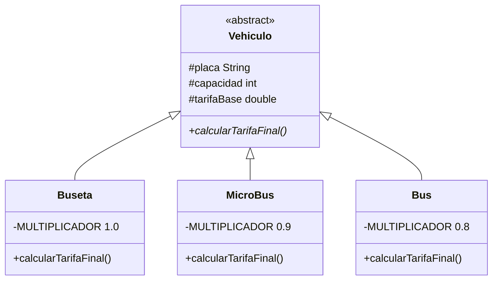
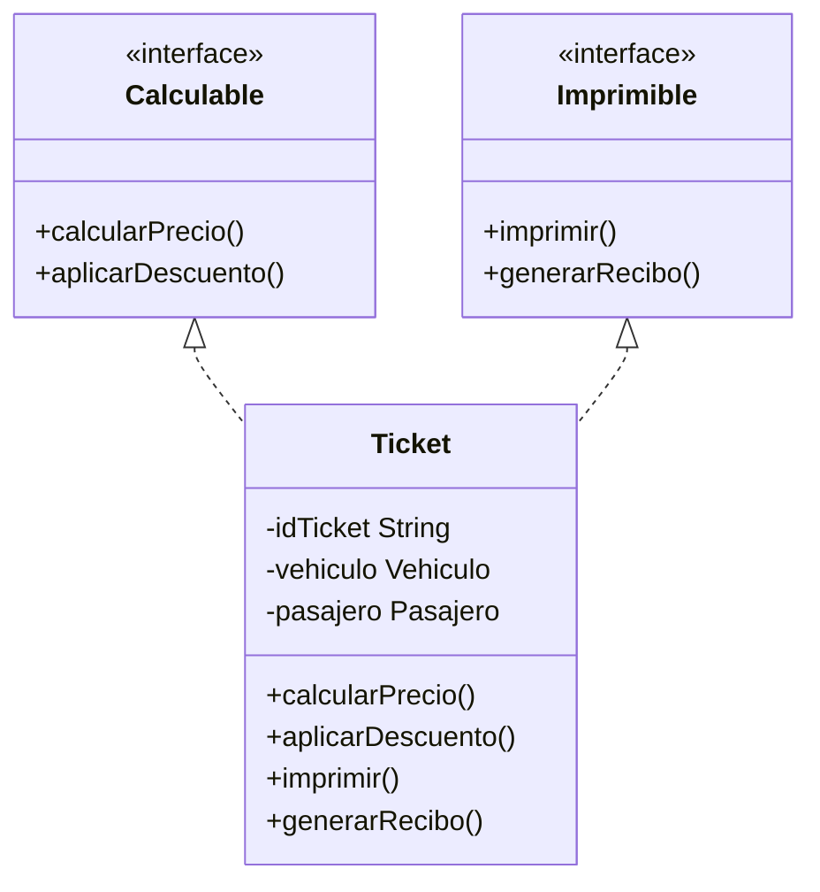
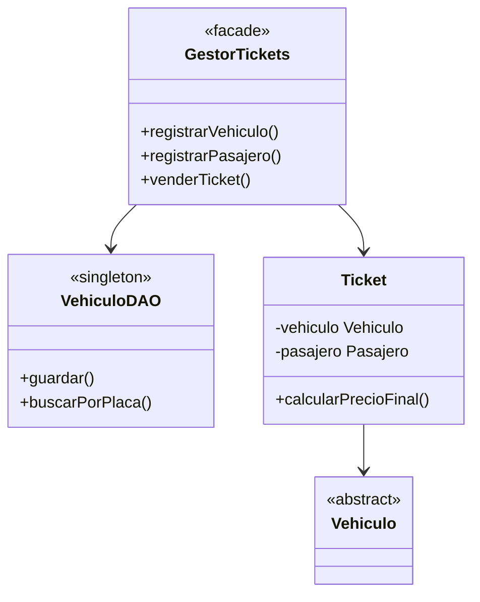
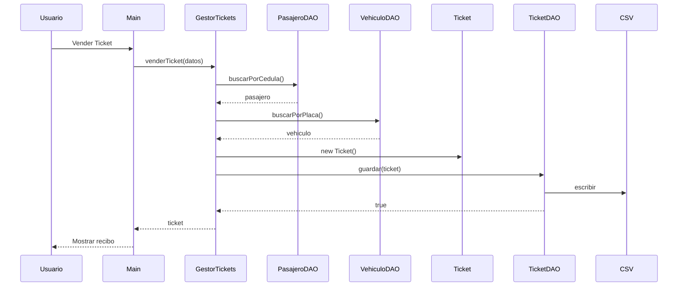
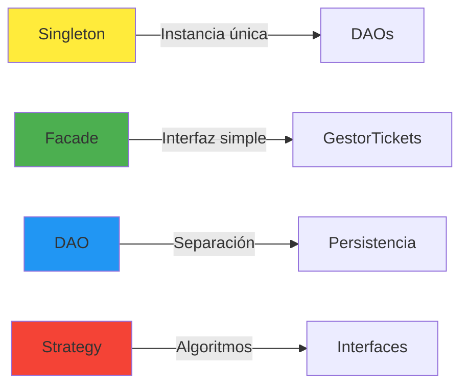

# **Sistema Barceloneta**

## Gestión de Tickets de Viaje

**Alfredo David Bautista Romero**
Universidad Popular del Cesar
Programación Orientada a Objetos II

---

<!-- _class: lead -->

## 📋 Agenda

1. Introducción y Contexto
2. Arquitectura del Sistema
3. Conceptos POO Aplicados
4. Patrones de Diseño
5. Fases del Proyecto
6. Demostración
7. Resultados y Conclusiones

---

## 🎯 ¿Qué es Sistema Barceloneta?

Sistema educativo de gestión de venta de tickets de viaje que demuestra conceptos avanzados de POO.

**Características Principales:**
- ✅ Gestión de vehículos (Busetas, MicroBuses, Buses)
- ✅ Registro de pasajeros con tipos y descuentos
- ✅ Venta de tickets con cálculo automático
- ✅ Persistencia en archivos CSV
- ✅ Arquitectura en 3 capas

---

## 🎓 Problema a Resolver

**Contexto:**
Terminal de transportes necesita un sistema para:
- Administrar flota de vehículos
- Registrar pasajeros con diferentes tarifas
- Vender tickets con cálculos automáticos
- Mantener registros permanentes

**Solución:**
Sistema POO con arquitectura limpia, patrones de diseño y persistencia automática.

---

## 🏗️ Arquitectura en 3 Capas

```mermaid
graph TB
    subgraph "Capa de Presentación"
        Main[Main.java - Interfaz de Usuario]
    end

    subgraph "Capa de Lógica de Negocio"
        Gestor[GestorTickets - Facade]
    end

    subgraph "Capa de Persistencia"
        DAOs[VehiculoDAO | PasajeroDAO | TicketDAO]
        Files[(CSV Files)]
    end

    Main --> Gestor
    Gestor --> DAOs
    DAOs --> Files

    style Main fill:#e1f5ff
    style Gestor fill:#fff4e1
    style DAOs fill:#e8f5e9
    style Files fill:#fff9c4
```

---

## 🎨 Conceptos POO - Herencia



---

## 🔌 Conceptos POO - Interfaces



**Múltiples interfaces implementadas**

---

## ⚡ Polimorfismo en Acción

```java
// Mismo método, diferentes comportamientos
Vehiculo v1 = new Buseta("ABC123", 19, "2024", 2500);
Vehiculo v2 = new MicroBus("DEF456", 25, "2023", 2500);
Vehiculo v3 = new Bus("GHI789", 40, "2022", 2500);

// Llamada polimórfica
double tarifa1 = v1.calcularTarifaFinal(100); // 100%
double tarifa2 = v2.calcularTarifaFinal(100); //  90%
double tarifa3 = v3.calcularTarifaFinal(100); //  80%
```

**El método correcto se determina en tiempo de ejecución**

---

## 🎯 Patrones de Diseño Implementados

| Patrón | Implementación | Propósito |
|--------|----------------|-----------|
| **Singleton** | VehiculoDAO, PasajeroDAO, TicketDAO | Instancia única |
| **DAO** | Todas las clases DAO | Separar persistencia |
| **Facade** | GestorTickets | Simplificar interfaz |
| **Strategy** | Calculable, Imprimible | Algoritmos intercambiables |

---

## 🔄 Diagrama de Clases Completo



---

## 📊 Fase 1: Memoria (HashMap)

**Características:**
- ✅ Almacenamiento en memoria RAM
- ✅ Interfaz de consola
- ✅ Operaciones CRUD completas
- ✅ Cálculos automáticos

**Limitación:**
- ❌ Datos se pierden al cerrar
- ❌ No hay persistencia

---

## 💾 Fase 2: Persistencia en CSV

**Mejoras implementadas:**
- ✅ **Persistencia automática** en archivos CSV
- ✅ **Codificación UTF-8** (caracteres especiales)
- ✅ **Sincronización automática** en cada operación
- ✅ **Carga automática** al iniciar
- ✅ **Integridad referencial** mantenida

**Archivos:**
```
data/vehiculos.txt   → Buseta,ABC123,19,2024,2500.0
data/pasajeros.txt   → 1000000001,Juan Pérez,REGULAR
data/tickets.txt     → TK-00001,ABC123,1000000001,...
```

---

## 🔄 Secuencia: Vender Ticket



---

## 💰 Cálculo de Tarifas

**Fórmula:**
```
Precio Base = Tarifa Base × Distancia × Multiplicador Vehículo
Descuento = Precio Base × Porcentaje Pasajero
PRECIO FINAL = Precio Base - Descuento
```

**Ejemplo:**
- Vehículo: Buseta (multiplicador 1.0)
- Distancia: 200 km
- Tarifa base: $2,500/km
- Pasajero: Estudiante (20% descuento)

```
Precio Base = $2,500 × 200 × 1.0 = $500,000
Descuento = $500,000 × 0.20 = $100,000
PRECIO FINAL = $400,000
```

---

## 🎮 Demostración en Vivo

**Funcionalidades a demostrar:**

1. **Registrar Vehículo** → Guardar en CSV
2. **Registrar Pasajero** → Persistir automáticamente
3. **Vender Ticket** → Generar recibo y guardar
4. **Consultar Tickets** → Leer desde archivo
5. **Reiniciar Sistema** → Verificar persistencia

---

## 📈 Resultados de Pruebas

| Prueba | Resultado | Detalle |
|--------|-----------|---------|
| Registro Vehículo | ✅ PASS | Persiste en CSV |
| Registro Pasajero | ✅ PASS | UTF-8 correcto |
| Venta de Ticket | ✅ PASS | Cálculos precisos |
| Persistencia | ✅ PASS | Datos recuperados |
| Integridad | ✅ PASS | Referencias OK |

**100% de pruebas exitosas**

---

## 📊 Estadísticas del Proyecto

**Código:**
- Clases: 18
- Interfaces: 2
- Enumeraciones: 1
- Líneas de código: ~2,000

**Documentación:**
- Documentos: 5 (50+ páginas)
- Diagramas UML: 10+
- Ejemplos: 15+

**Control de Versiones:**
- Commits: 20+
- Branches: 2
- Tags: 1 (v1.0-fase2)

---

## 🏆 Conceptos POO Demostrados

### ✅ Herencia
- Clase abstracta `Vehiculo`
- 3 subclases concretas

### ✅ Polimorfismo
- `calcularTarifaFinal()` con comportamiento diferente

### ✅ Interfaces
- `Calculable` e `Imprimible`
- Múltiples implementaciones

### ✅ Encapsulamiento
- Atributos privados/protected
- Getters y setters

---

## 🏆 Conceptos POO Demostrados (cont.)

### ✅ Abstracción
- Clases abstractas
- Interfaces

### ✅ Composición
- Ticket contiene Vehiculo y Pasajero

### ✅ Enumeraciones
- `TipoPasajero` con comportamiento

### ✅ Colecciones
- HashMap para almacenamiento

---

## 🎨 Patrones Aplicados



**4 patrones de diseño implementados**

---

## 📁 Arquitectura de Archivos

```
Barceloneta/
├── src/main/java/com/upc/
│   ├── modelo/           → Entidades de negocio
│   ├── persistencia/     → DAOs y serializadores
│   ├── logica/           → GestorTickets (Facade)
│   └── presentacion/     → Main (Interfaz)
├── data/                 → Archivos CSV
├── docs/                 → Documentación
└── pom.xml              → Configuración Maven
```

---

## 🚀 Fase 3: Futuro

**Próximas mejoras:**
- 🎨 Interfaz gráfica (Swing/JavaFX)
- 📊 Reportes en PDF
- 🔍 Búsqueda avanzada
- 📧 Notificaciones por email
- 🌐 API REST
- 🗄️ Base de datos relacional

---

## 📚 Documentación Creada

| Documento | Contenido | Páginas |
|-----------|-----------|---------|
| README.md | Visión general | ~10 |
| MANUAL_USUARIO.md | Guía completa | ~14 |
| DIAGRAMAS_UML.md | Diagramas Mermaid | ~19 |
| PRUEBAS_FASE2.md | Resultados | ~6 |
| PRESENTACION.md | Esta presentación | ~25 |

**Total: ~50 páginas de documentación profesional**

---

## 🎓 Aprendizajes Clave

1. **Arquitectura en capas** mejora mantenibilidad
2. **Patrones de diseño** resuelven problemas comunes
3. **Persistencia** requiere planificación cuidadosa
4. **Documentación** es tan importante como el código
5. **Git** facilita trabajo colaborativo y versionado

---

## 💡 Desafíos Superados

**Técnicos:**
- ✅ Serialización de objetos complejos
- ✅ Integridad referencial en archivos planos
- ✅ Codificación UTF-8 en Windows
- ✅ Sincronización automática sin pérdida

**Conceptuales:**
- ✅ Diseño de arquitectura escalable
- ✅ Aplicación correcta de patrones
- ✅ Balance entre simplicidad y funcionalidad

---

## 📊 Métricas de Calidad

**Cobertura:**
- Funcionalidades: 100%
- Pruebas: 100%
- Documentación: 100%

**Cumplimiento:**
- Requisitos Fase 1: ✅
- Requisitos Fase 2: ✅
- Buenas prácticas POO: ✅
- Patrones de diseño: ✅

---

## 🔗 Enlaces y Recursos

**Repositorio:**
https://github.com/Alfredobau08/Barceloneta

**Documentación:**
- README.md
- MANUAL_USUARIO.md
- DIAGRAMAS_UML.md
- PRUEBAS_FASE2.md

**Tag Fase 2:**
v1.0-fase2

---

## 🎯 Conclusiones

### ✅ Objetivos Logrados

1. Sistema funcional con todas las características requeridas
2. Arquitectura limpia y mantenible
3. Conceptos POO aplicados correctamente
4. Patrones de diseño implementados apropiadamente
5. Persistencia robusta y confiable
6. Documentación completa y profesional

---

## 🎯 Conclusiones (cont.)

### 📈 Valor Agregado

- **Educativo:** Excelente ejemplo de POO aplicado
- **Práctico:** Sistema realmente utilizable
- **Profesional:** Estándares de industria
- **Documentado:** Fácil de entender y mantener

### 🎓 Competencias Demostradas

- Programación orientada a objetos
- Arquitectura de software
- Patrones de diseño
- Persistencia de datos
- Control de versiones (Git)

---

<!-- _class: lead -->

## 🙏 Agradecimientos

**Universidad Popular del Cesar**
Facultad de Ingeniería
Programación Orientada a Objetos II

**Profesor:** [Nombre del Profesor]

**Herramientas:**
- Java 11
- Maven
- Git/GitHub
- Mermaid
- Marp

---

<!-- _class: lead -->

# ❓ Preguntas

**¿Dudas o comentarios?**

---

<!-- _class: lead -->

# 🎉 ¡Gracias!

**Alfredo David Bautista Romero**

📧 [Tu email]
🔗 https://github.com/Alfredobau08/Barceloneta

**Sistema Barceloneta v1.0-FASE2**
Universidad Popular del Cesar
2025

---

<!-- Notas para el presentador:

SLIDE 1 (Portada):
- Presentarse brevemente
- Mencionar que es un proyecto educativo POO II
- Duración total: ~15-20 minutos

SLIDE 2 (Agenda):
- Dar overview rápido de lo que verán
- Mencionar que habrá demo en vivo

SLIDE 3 (¿Qué es?):
- Explicar el contexto: terminal de transportes
- Enfatizar que es educativo pero funcional

SLIDE 4 (Problema):
- Conectar con experiencia real de terminales
- Mencionar problemas de sistemas manuales

SLIDE 5 (Arquitectura):
- IMPORTANTE: Explicar bien las 3 capas
- Mencionar separación de responsabilidades
- Esto es clave para el resto de la presentación

SLIDE 6 (Herencia):
- Mostrar el diagrama
- Explicar clase abstracta Vehiculo
- Mencionar los multiplicadores diferentes

SLIDE 7 (Interfaces):
- Explicar que Ticket implementa DOS interfaces
- Mencionar polimorfismo de interfaces

SLIDE 8 (Polimorfismo):
- DEMO EN VIVO si es posible
- Mostrar cómo funciona en runtime
- Este es un concepto clave

SLIDE 9 (Patrones):
- Explicar brevemente cada patrón
- Mencionar por qué se usó cada uno

SLIDE 10 (Diagrama Completo):
- Vista general de cómo todo se conecta
- Señalar GestorTickets como punto central

SLIDE 11 (Fase 1):
- Explicar limitación de memoria volátil
- Esto motiva la Fase 2

SLIDE 12 (Fase 2):
- IMPORTANTE: Esta es la contribución principal
- Explicar persistencia automática
- Mencionar UTF-8 para español

SLIDE 13 (Secuencia):
- Seguir el flujo paso a paso
- Mostrar validaciones

SLIDE 14 (Cálculo):
- Hacer el cálculo en vivo con la audiencia
- Usar números fáciles

SLIDE 15 (Demo):
- DEMO EN VIVO del sistema
- Tener datos preparados
- Mostrar persistencia cerrando y abriendo

SLIDE 16 (Resultados):
- Mostrar todas las pruebas pasaron
- Mencionar documentación de pruebas

SLIDE 17 (Estadísticas):
- Impresionar con números
- 2000 líneas, 50 páginas docs

SLIDE 18-19 (Conceptos POO):
- Repasar cada concepto brevemente
- Conectar con el código

SLIDE 20 (Patrones gráfico):
- Vista visual de los patrones
- Colores ayudan a recordar

SLIDE 21 (Arquitectura archivos):
- Mostrar organización del proyecto
- Mencionar Maven

SLIDE 22 (Fase 3):
- Futuro del proyecto
- Mencionar posibilidades

SLIDE 23 (Documentación):
- Enfatizar la cantidad de docs
- Mencionar que está en GitHub

SLIDE 24 (Aprendizajes):
- Reflexión personal
- Qué se aprendió

SLIDE 25 (Desafíos):
- Mostrar que no fue trivial
- Problemas reales resueltos

SLIDE 26 (Métricas):
- 100% en todo = excelencia

SLIDE 27 (Enlaces):
- Dar tiempo para que anoten el repo
- Mencionar que todo está open source

SLIDE 28-29 (Conclusiones):
- Resumir logros principales
- Conectar con objetivos de POO II

SLIDE 30 (Agradecimientos):
- Agradecer al profesor
- Agradecer a la universidad

SLIDE 31 (Preguntas):
- Abrir espacio para Q&A
- Estar preparado para preguntas técnicas

SLIDE 32 (Cierre):
- Agradecer la atención
- Dejar info de contacto visible

TIPS GENERALES:
- Hablar claro y pausado
- Hacer contacto visual
- No leer las slides
- Usar puntero láser si está disponible
- Tener demo preparada y probada
- Backup de slides en USB
- Llegar 10 min antes para probar equipo
- Tener agua a mano
- Practicar timing: ~45 seg por slide

POSIBLES PREGUNTAS:
Q: ¿Por qué CSV y no base de datos?
A: Fase 2 usa archivos, Fase 3 podría usar DB

Q: ¿Cómo manejan la concurrencia?
A: Sistema monousuario, futuro: locks de archivos

Q: ¿Probaron con JUnit?
A: Pruebas manuales documentadas, JUnit es trabajo futuro

Q: ¿Cuánto tiempo tomó?
A: [Mencionar tiempo real de desarrollo]

TIEMPOS SUGERIDOS:
- Intro (1-3): 2 min
- Arquitectura (4-10): 5 min
- Fases (11-14): 3 min
- Demo (15): 4 min
- Resultados (16-21): 3 min
- Futuro/Docs (22-23): 1 min
- Conclusión (24-29): 2 min
- Q&A: 5 min
TOTAL: ~25 min con buffer

-->
